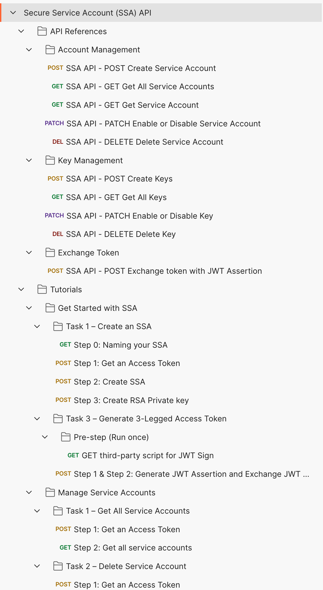

# Postman Collection for APS Secure Service Account (SSA) API

[%20API-v1-green.svg)](https://aps.autodesk.com/en/docs/ssa/v1/developers_guide/overview/)

This folder contains a Postman Collection that includes all the currentAPS Secure Service Account (SSA) API. The collection together with the environment help you easily test these endpoints.

## Instructions to run the Postman collection are as below

### Setup Postman environment and Get Started

- Import Postman environment & collection, please setup the following environment vialables,
  - client_id:     APS App Id.
  - client_secret: APS App Secret.
  - token_scope: The final OAuth scopes you want to play with other APS API as you do for getting regular three-legged access tokens.

    

- Please get started from the scripts under Tutorials folder and follow the instructions of [Get Started with SSA](https://aps.autodesk.com/en/docs/ssa/v1/tutorials/getting-started-with-ssa/) tutorial on the [APS Dev Portal](https://aps.autodesk.com/) to create your first SSA robot account.

    

###  Use the script **GET third-party script for JWT Sign** to get the third-party JavaScript library to sign JWT assertion.

- The CryptoJS in Postman doesn't support RS256 as sign algorithm, so we use a third-party script for JWT Sign.
- It will fetch the script from https://cdnjs.cloudflare.com/ajax/libs/jsrsasign/8.0.20/jsrsasign-all-min.js and save the content in an environment variable of Postman called `jsrsasign-js`.

    

## Tips & Tricks

- **Naming your SSA**: Before creating a SSA robot, please ensure you give it names in the `Step 0: Naming your SSA` script under the [Get Started with SSA](https://aps.autodesk.com/en/docs/ssa/v1/tutorials/getting-started-with-ssa/) tutorial, following the [Naming guides](https://aps.autodesk.com/en/docs/ssa/v1/developers_guide/naming-guidelines/).

    

- **Generate JWT Assertion**: The `Step 1 & Step 2: Generate JWT Assertion and Exchange JWT Assertion for a Token` script under the [Task 3 – Generate 3-Legged Access Token](https://aps.autodesk.com/en/docs/ssa/v1/tutorials/getting-started-with-ssa/task3-generate-3-legged-access-token/) tutorial generates JWT assertion in the Pre-request, and set the assertion into Postman's environment variables.

    

## License

This sample is licensed under the terms of the [MIT License](http://opensource.org/licenses/MIT). Please see the [LICENSE](LICENSE) file for full details.

## Written by

Eason Kang [in/eason-kang-b4398492/](https://www.linkedin.com/in/eason-kang-b4398492), [Developer Advocate](http://aps.autodesk.com)
